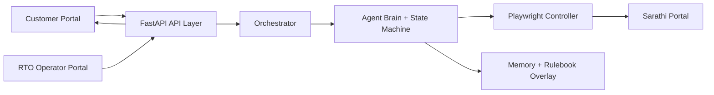

# Sarathi RTO Automation Agent

Live app: [https://thxz3gzmhf.ap-south-1.awsapprunner.com/](https://thxz3gzmhf.ap-south-1.awsapprunner.com/)

## Problem
Sarathi is slow, form-heavy, and error-prone for end users.  
Goal: customer should **not** fill government forms directly. They should upload details once, then the agent completes the workflow with minimal human effort.

## Solution
This project provides a production-style automation stack:
- Customer portal for onboarding + live progress + OTP/captcha/customer inputs.
- Agentic backend that operates Sarathi in Playwright.
- RTO operator portal (admin) for monitoring, status updates, notes, and application tracking.
- Customer lookup by phone/customer ID/application number with timeline status.

## Architecture + Flow


End-to-end loop:
1. Customer submits details.
2. Agent starts Sarathi flow.
3. If Sarathi needs OTP/captcha/choice, backend emits actionable state.
4. Customer responds in UI.
5. Backend resumes agent immediately.
6. Agent continues until submitted / retried / escalated.
7. Status is visible to both customer and operator.

## Why this is strong (unique points)
- **Self-healing loop**: observe -> reason -> act -> verify -> diagnose -> retry.
- **No blind loops**: max attempts, retry budgets, and escalation points are enforced.
- **Dynamic fallback strategy**: selector click fallback chain, modal handling, captcha retries, OTP resend path.
- **Human-in-loop by design**: only when needed; clear action requests.
- **Real-time state sync**: customer UI is driven by backend state/action flags, not assumptions.
- **Memory + rules**:
  - LearningStore captures what worked.
  - Rulebook overlay (`data/discovered_rules.json`) enables deterministic next runs with lower latency.
- **Portal specific today, extensible tomorrow**:
  orchestration/state/human-loop are reusable; portal rules and flows are configurable.

## Core capabilities (must-know)
- **Self-learning + self-healing in real time**: when a path fails, agent diagnoses why (DOM/state/error/log context), tries alternate heuristics, and continues until success or safe escalation.
- **Learns from success**: successful alternate actions are persisted to memory/rule overlay, so next run becomes more deterministic and lower-latency.
- **Production guardrails**: max attempts, retry caps, loop prevention, actionable customer prompts, and customer-safe error mapping.
- **Bidirectional operation**: customer input -> agent -> Sarathi -> agent -> customer (OTP/captcha/choices/confirmations) with live status.
- **Not locked to one flow only**: architecture supports adding new services/workflows by rule + step modules without rewriting the core engine.

## How self-learning works (concrete)
1. Agent attempts deterministic rule path.
2. If blocked, it reads live portal context (DOM, URL, visible actions, logs/errors).
3. It selects a different heuristic path (fallback action chain).
4. It verifies outcome (URL/state transition / expected element / status change).
5. On success, it records the winning action in memory and discovered rules.
6. Future runs prefer the discovered deterministic path first.
7. If still unresolved after limits, it requests precise human input and resumes.

## Agent Internals (short)
- Brain: `agent/brain.py`
- Memory: `agent/learning_store.py`
- Rulebook: `config/portal_rules.py` (+ discovered overlay)
- State machine: `agent/state_manager.py`
- Human loop: `agent/human_loop.py`
- Orchestration: `orchestrator.py`
- Browser control: `browser/controller.py`

## Customer <-> Agent <-> Sarathi bidirectional behavior
- Customer gives input -> agent fills Sarathi.
- Sarathi asks for input -> agent asks customer in UI with context.
- Customer replies -> agent resumes and continues.
- Errors are mapped to customer-safe language (`api/status_messages.py`).

## OCR/ICR + document intelligence
- OCR reads DL data (number, DOB, name, etc.) from uploaded document images.
- The agent validates and normalizes extracted values before portal usage.
- If extraction quality is low or fields are missing, customer can correct values in UI.
- Designed to support stronger ICR/OCR classifiers and confidence-gated acceptance.

## OTP intelligence (Aadhaar + mobile)
- Supports both **Aadhaar OTP** flow and **phone OTP** flow.
- Backend uses explicit action states (`WAITING_OTP`, `STUCK_HUMAN_NEEDED`) so UI asks at the right time.
- Wrong/expired OTP handling is mapped into clear customer prompts with resend/retry path.

## CAPTCHA intelligence + human fallback
- Agent attempts automatic captcha solving with retry strategy.
- On repeated failure, customer UI receives captcha image and asks manual entry (human-in-loop).
- Customer answer is fed back instantly and agent resumes from the same flow.

## Two portals
- **Customer portal**: start application, OTP/captcha inputs, live tracking.
- **RTO operator portal** (`/admin`): search customers/apps, update status, add notes, view documents/events.

## CI/CD (short)
- GitHub Actions workflow: `.github/workflows/deploy.yml`
- Build container -> push to ECR -> deploy/update AWS App Runner.
- Health endpoint can be used for deployment verification.

## Next upgrades (roadmap)
- Persist structured run logs/screenshots to **S3** for traceability + debugging.
- Add **face match + liveness/confidence scoring** (DL photo vs live capture) with configurable thresholds and rejection policy.
- Optimize latency/cost by promoting stable learned actions to deterministic rules sooner.
- Expand service packs beyond DL renewal via configurable flow/rule modules.

## Local run
Install dependencies:
```powershell
cd C:\Users\yashs\OneDrive\Desktop\token26
pip install -r requirements.txt
playwright install chromium
```

Run API + UI:
```powershell
cd C:\Users\yashs\OneDrive\Desktop\token26
uvicorn api.server:app --host 127.0.0.1 --port 8001 --reload
```
Open: [http://127.0.0.1:8001](http://127.0.0.1:8001)

Run direct backend-agent test:
```powershell
cd C:\Users\yashs\OneDrive\Desktop\token26
python -X utf8 run_agent.py
```

## Submitted by
- Jai Sipani
- Email: sipanijai@gmail.com
- GitHub username: test-user98
