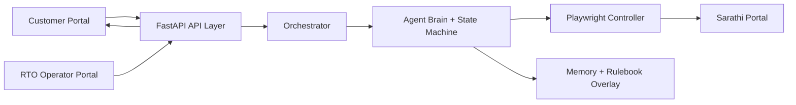

# Sarathi RTO Automation Agent

Live app: [https://thxz3gzmhf.ap-south-1.awsapprunner.com/](https://thxz3gzmhf.ap-south-1.awsapprunner.com/)

## Problem
Sarathi is slow, form-heavy, and error-prone for end users.  
Goal: customer should **not** fill government forms directly. They should upload details once, then the agent completes the workflow with minimal human effort.

## Solution
This project provides a production-style automation stack:
- Customer portal for onboarding + live progress + OTP/captcha/customer inputs.
- Agentic backend that operates Sarathi in Playwright.
- RTO operator portal (admin) for monitoring, status updates, notes, and application tracking.
- Customer lookup by phone/customer ID/application number with timeline status.

## Architecture + Flow


End-to-end loop:
1. Customer submits details.
2. Agent starts Sarathi flow.
3. If Sarathi needs OTP/captcha/choice, backend emits actionable state.
4. Customer responds in UI.
5. Backend resumes agent immediately.
6. Agent continues until submitted / retried / escalated.
7. Status is visible to both customer and operator.

## Why this is strong (unique points)
- **Self-healing loop**: observe -> reason -> act -> verify -> diagnose -> retry.
- **No blind loops**: max attempts, retry budgets, and escalation points are enforced.
- **Dynamic fallback strategy**: selector click fallback chain, modal handling, captcha retries, OTP resend path.
- **Human-in-loop by design**: only when needed; clear action requests.
- **Real-time state sync**: customer UI is driven by backend state/action flags, not assumptions.
- **Memory + rules**:
  - LearningStore captures what worked.
  - Rulebook overlay (`data/discovered_rules.json`) enables deterministic next runs with lower latency.
- **Portal specific today, extensible tomorrow**:
  orchestration/state/human-loop are reusable; portal rules and flows are configurable.

## Agent Internals (short)
- Brain: `agent/brain.py`
- Memory: `agent/learning_store.py`
- Rulebook: `config/portal_rules.py` (+ discovered overlay)
- State machine: `agent/state_manager.py`
- Human loop: `agent/human_loop.py`
- Orchestration: `orchestrator.py`
- Browser control: `browser/controller.py`

## Customer <-> Agent <-> Sarathi bidirectional behavior
- Customer gives input -> agent fills Sarathi.
- Sarathi asks for input -> agent asks customer in UI with context.
- Customer replies -> agent resumes and continues.
- Errors are mapped to customer-safe language (`api/status_messages.py`).

## Two portals
- **Customer portal**: start application, OTP/captcha inputs, live tracking.
- **RTO operator portal** (`/admin`): search customers/apps, update status, add notes, view documents/events.

## CI/CD (short)
- GitHub Actions workflow: `.github/workflows/deploy.yml`
- Build container -> push to ECR -> deploy/update AWS App Runner.
- Health endpoint can be used for deployment verification.

## Next upgrades (roadmap)
- Persist structured run logs/screenshots to **S3** for traceability + debugging.
- Add **face match + liveness/confidence scoring** (DL photo vs live capture) with configurable thresholds and rejection policy.
- Optimize latency/cost by promoting stable learned actions to deterministic rules sooner.
- Expand service packs beyond DL renewal via configurable flow/rule modules.

## Local run
```powershell
cd C:\Users\yashs\OneDrive\Desktop\token26
uvicorn api.server:app --host 127.0.0.1 --port 8001 --reload
```
Open: [http://127.0.0.1:8001](http://127.0.0.1:8001)
